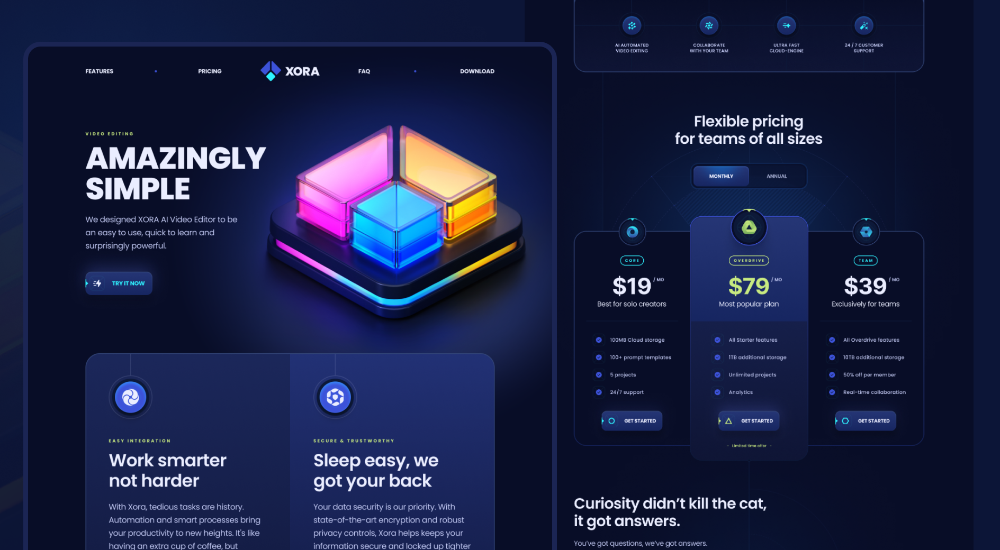

<div align="center">
  <br />
      
  <br />

  <div>
    
    
    
  </div>

<h3 align="center">Xora – Modern SaaS UI/UX Website</h3>

   <div align="center">
     A modern, responsive SaaS landing page built with React, Vite, and Tailwind CSS. <br />
    </div>
</div>

## 📋 Table of Contents

1. 🚀 [About](#about)
2. ⚙️ [Tech Stack](#tech-stack)
3. ✨ [Features](#features)
4. 🏁 [Quick Start](#quick-start)
5. 🖼️ [Assets](#assets)

## 🚀 About

**Xora** is a modern SaaS landing page template that demonstrates best practices in UI/UX, component architecture, and responsive design. <br />
The project is a reference for building beautiful, performant web apps with React and Tailwind CSS.

## ⚙️ Tech Stack

- **React 19**
- **Tailwind CSS**
- Useful libraries: `clsx`, `react-countup`, `react-scroll`, `react-slidedown`

## ✨ Features

- Beautiful, responsive sections: Hero, Features, Pricing, FAQ, Testimonials, Download, Footer
- Smooth animations and gradients
- Intuitive navigation and scroll
- Optimized for performance and accessibility
- Clean, reusable component structure

## 🏁 Quick Start

Clone the repository and install dependencies:

```bash
git clone https://github.com/CreatorMilad/xora.git
cd xora
npm install
npm run dev
```

Open [http://localhost:5173](http://localhost:5173) in your browser to view the project.

## 🖼️ Assets

All images and assets are located in the `/public/images` directory.

---

## 🤝 Contributing

Contributions are welcome! Please follow these steps:
1. Fork the repository.
2. Create a new branch.
3. Commit your changes.
4. Submit a pull request.

---

## 📜 License

This project is licensed under the MIT License. See the [LICENSE](LICENSE) file for details.


---

### 🔗 Connect with Me
<!-- - GitHub: [Visit Profile](https://github.com/erfansafarzad7) -->
- LinkedIn: [Visit Profile](https://linkedin.com/in/erfansafarzad7)
- Email: [Send Me an Email](mailto:erfansafarzad7@gmail.com)
- Telegram: [Send Me Message](https://t.me/erfansafarzad7)

---

Happy Coding! 🎉
